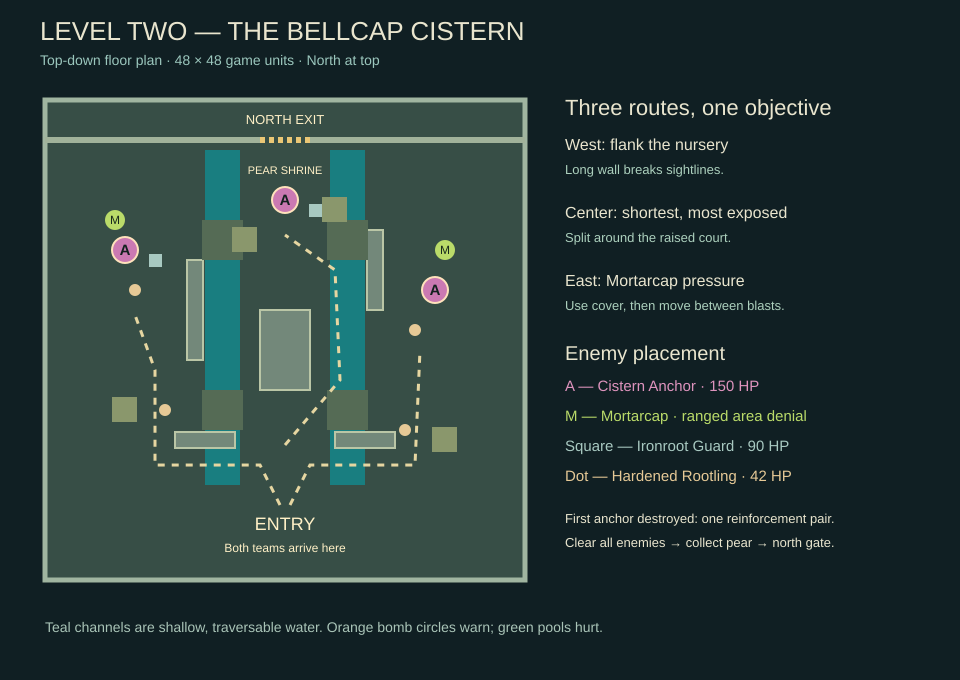

# Level two: The Bellcap Cistern

A new flooded ruin with glowing fungal growth, shallow teal channels, amber lamps and three corruption anchors. The layout replaces the first level's lanes with an asymmetric central court and two flanking routes. Existing stone and foliage assets are reused in a new arrangement; the floor shader, fungal scenery and Mortarcap model are new procedural artwork.

## Enter the level

Open **Play-Level-Two.cmd** for the shared-keyboard version. You can return to solo/controller mode in the lobby. In normal **Play.cmd**, select **Level 2: Bellcap Cistern** in the lobby, or eat level one's Golden Pear to travel straight into level-two combat. No gate walk or extra start button is required. Transitions retain the selected characters, input mode and active keyboard gnomes, and start the next level with full health and fresh cooldowns.

The latest portable bundle is **builds/Dark-Forest-Gauntlet-Celebration.zip**. Extract it completely and open **Play-Keyboard-Coop.cmd** for the full campaign, or **Play-Level-Two.cmd** to skip ahead. Escape level two to reveal a parchment celebration scroll with Maria jumping in a seamless two-second loop. **Play Again** returns to level-one selection. The bundle includes a GIF preview, the original level and power showcase.

## Floor plan

- **Entry court:** a broad staging space with split low barricades. Four stronger Rootlings establish the opening pressure.
- **West nursery:** a long wall blocks direct shots, giving a choice between the outer flank and the central crossing. One anchor is supported by a Mortarcap and Guard.
- **Central court:** a solid raised obstacle divides movement. The central route is shorter but can expose the party to ranged marks from either side.
- **East gallery:** a second long wall creates cover near another anchor and Mortarcap. There is space to dodge around the nearby plinth.
- **Northern vault:** the third anchor and an Ironroot Guard protect the route toward the pear shrine and exit.

The water channels are shallow and traversable; only the clearly marked spore pools deal environmental damage. Kill all enemies, collect the Golden Pear, and bring every surviving gnome through the northern gate.

## Enemies and escalation

| Enemy | Starting count | Health | Behavior |
| --- | ---: | ---: | --- |
| Cistern Anchor | 3 | 150 | Spawns a Hardened Rootling every 7 seconds while alive. |
| Hardened Rootling | 4 | 42 | Familiar melee pressure, now dealing 14 damage per hit. |
| Ironroot Guard | 2 | 90 | Larger armored silhouette; slower movement, a readable 0.8-second windup and a 20-damage strike. |
| Mortarcap | 2 | 60 | Ranged mushroom creature that marks a survivor's current position and drops a spore bomb. |

Destroying the first anchor summons **one additional Guard and Mortarcap**, once per encounter. Mobile enemies are capped at 16, so living anchors cannot create an unlimited swarm. The opening has 11 enemies versus four in the first level.

## The Mortarcap changes the fight

Its orange **MOVE!** circle stays where the target stood. There is a **1.2-second warning** before a **22-damage impact**. A green pool remains for **2.7 seconds**, dealing **6 damage every 0.65 seconds** to players inside it, subject to their usual invulnerability rules.

Step outside the circle, or interrupt the caster with a snare, knockback, or a killing blow before detonation. The bomb does not retarget a dodging player. Line-of-sight checks prevent damage through solid cover. Already active pools finish their short lifetime even if their caster dies. All hazards clear when the encounter ends.

Following companions try to move away from warning circles and active pools. They still use basic attacks only; players choose when to switch and spend each gnome's realm power.

## Verification

- **168 regression checks:** includes 23 level-two checks and 12 campaign-transition, roster, celebration and loop checks.
- An input-driven paired-keyboard playthrough cleared the encounter and exited with all four survivors, without changing health, damage, cooldowns or enemy AI. This establishes a playable route, not final human balance.
- Captures of the floor plan, lobby, warning and pool are in `artifacts/level-two/`.
- Opening the gate now updates companion navigation in both levels, and companions follow through rather than stopping just short of the exit.
- Packaging runs the normal game, showcase, keyboard mode and direct level-two launcher, then verifies archive hashes.

This is a first playable level-two design. Two-person feedback should focus on whether bomb warnings are easy to read, whether the flank routes feel useful, and whether the Guard/Mortarcap combination needs more or less pressure. The Windows bundle remains an editor-runtime playtest export.
